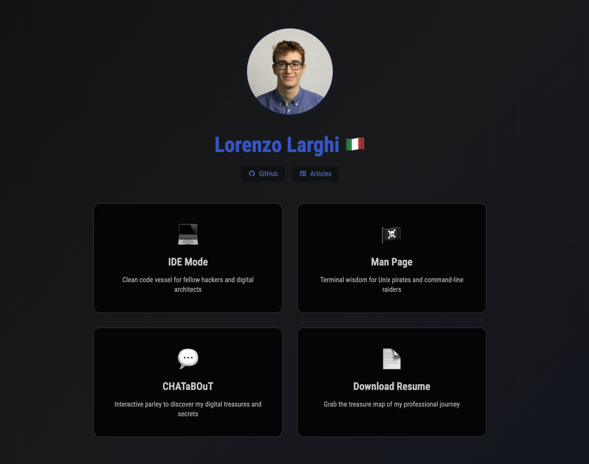

# 🏴‍☠️ Lorenzo Larghi - Digital Portfolio

> _"Code pirate, cypherpunk, and terminal dweller sailing the digital seas"_

[](https://your-portfolio-url.com)
[](https://astro.build/)
[](https://typescriptlang.org/)
[](https://neovim.io/)

## 📸 Preview

<div align="center">
  
  <p><em>Landing page showcasing the multi-theme portfolio experience</em></p>
</div>

## 🎭 Choose Your Experience

This portfolio offers **three unique themes** to match different audiences and moods:

### 💻 **IDE Mode**

- **Theme**: Gruvbox-inspired developer aesthetic
- **Audience**: Fellow hackers and digital architects
- **Features**: IDE-like interface, code syntax styling
- **Vibe**: "This is what I see 15 hours a day"

### 🏴‍☠️ **Man Page**

- **Theme**: Monochrome Unix terminal
- **Audience**: Unix pirates and command-line raiders
- **Features**: Traditional `man` page format
- **Vibe**: "This is what I wish we were still seeing 15 hours a day"

### 💬 **CHATaBOuT**

- **Theme**: Interactive chat interface
- **Audience**: Curious explorers
- **Features**: Conversational portfolio discovery
- **Vibe**: "Try to run `rm -fr /`"

## 🛠️ Tech Stack

### **Framework & Core**

- **[Astro](https://astro.build/)** - Modern static site generator
- **TypeScript** - Type-safe JavaScript
- **CSS3** - Custom styling with CSS variables
- **Responsive Design** - Mobile-first approach

### **UI Components**

- **[Astro Icon](https://github.com/natemoo-re/astro-icon)** - SVG icon system
- **CSS Grid & Flexbox** - Modern layouts
- **CSS Custom Properties** - Dynamic theming

### **Fonts & Assets**

- **Roboto Condensed** - Main UI font (cyberpunk theme)
- **JetBrains Mono** - Monospace font (terminal themes)
- **Custom SVG Icons** - GitHub, articles, social links

## 🚀 Quick Start

```bash
# Clone the repository
git clone https://github.com/elel-dev/portfolio.git
cd portfolio

# Install dependencies
npm install

# Start development server
npm run dev

# Build for production
npm run build

# Preview production build
npm run preview
```

<div align="center">

**Made with ❤️ and ☕ by a digital pirate**

_"No LinkedIn found - this pirate navigates different waters"_

</div>
